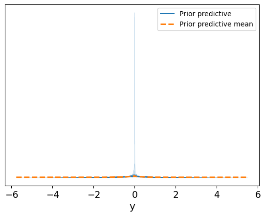
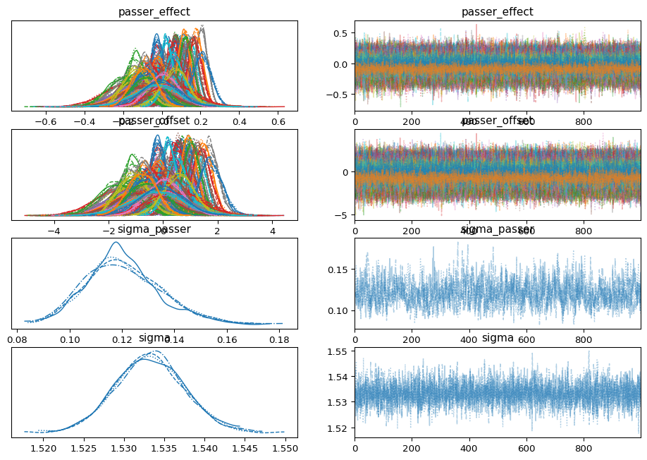
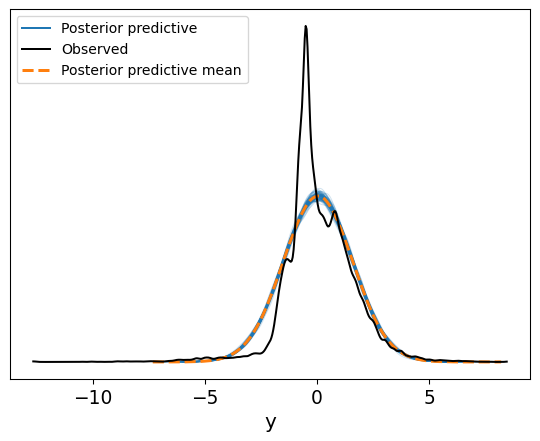

# Load public data

``` python
import numpy as np
import pandas as pd
import pymc as pm
import xarray as xr
import arviz as az
from arviz.stats.stats import hdi
from scipy import stats as stats
from matplotlib import pyplot as plt
import duckdb
import polars as pl
from plotnine import ggplot, aes, geom_density

rng = 527
```

``` python
qbs = (
    pl.read_parquet(
        "https://github.com/nflverse/nflverse-data/releases/download/pbp/play_by_play_2024.parquet"
    )
    .filter(
        (pl.col("wp").is_between(0.1, 0.9))
        & (pl.col("penalty") == 0)
        & (pl.col("qb_dropback") == 1)
        & (pl.col("season_type") == "REG")
    )
    .with_columns(qb_dropbacks=pl.col("qb_dropback").sum().over(["passer_id"]))
    #.filter(pl.col("qb_dropbacks") > 1)
    .select(["passer_id", "passer", "posteam", "complete_pass", "qb_epa", "qb_dropbacks"])
)

qb_ids = qbs["passer", "passer_id"].unique()

qbs.head()
```

<div><style>
.dataframe > thead > tr,
.dataframe > tbody > tr {
  text-align: right;
  white-space: pre-wrap;
}
</style>
<small>shape: (5, 6)</small>

| passer_id    | passer     | posteam | complete_pass | qb_epa    | qb_dropbacks |
|--------------|------------|---------|---------------|-----------|--------------|
| str          | str        | str     | f64           | f64       | f64          |
| "00-0035228" | "K.Murray" | "ARI"   | 1.0           | 2.028874  | 487.0        |
| "00-0035228" | "K.Murray" | "ARI"   | 1.0           | 0.754242  | 487.0        |
| "00-0035228" | "K.Murray" | "ARI"   | 1.0           | 1.6808    | 487.0        |
| "00-0035228" | "K.Murray" | "ARI"   | 0.0           | -0.467625 | 487.0        |
| "00-0035228" | "K.Murray" | "ARI"   | 0.0           | -0.985448 | 487.0        |

</div>

### Model componets

``` python
ggplot(qbs, aes("qb_epa")) + geom_density()
print(f"Mean QB EPA/play: {qbs["qb_epa"].mean():.2f}")
print(f"Mode QB EPA/play: {qbs["qb_epa"].round(1).mode()[0]:.2f}")
```

    Mean QB EPA/play: 0.06
    Mode QB EPA/play: -0.50

``` python
# categorical to int indexes for pymc
PASSER_IDX, PASSER_ID = pd.factorize(qbs["passer_id"].to_pandas(), sort=True)
N_PASSERS = qbs["passer_id"].n_unique()
```

### Configure Model

``` python
coords = {"passer_id": PASSER_ID, "n_passers": [N_PASSERS]}

with pm.Model(coords=coords) as model:

    # data
    passer_idx_data = pm.Data("passer_idx", PASSER_IDX, dims="obs_id")

    # parameters
    sigma = pm.HalfNormal("sigma", sigma=0.5)
    sigma_passer = pm.HalfNormal("sigma_passer", sigma=0.5)
    passer_offset = pm.Normal(
        "passer_offset",
        mu=-0.2,
        sigma=1,
        dims="passer_id",
    )

    # generated quantities
    passer_effect = pm.Deterministic(
        "passer_effect", passer_offset * sigma_passer, dims="passer_id"
    )
    mu = pm.Deterministic("mu", passer_effect[passer_idx_data], dims='obs_id')

    # Likelihood
    y = pm.Normal("y", mu=mu, sigma=sigma, observed=qbs["qb_epa"])
    y_pred = pm.Normal("y_pred", mu=mu, sigma=sigma, dims="obs_id")
```

### Prior predictive checks

``` python
with model:
    idata = pm.sample_prior_predictive()
```

    Sampling: [passer_offset, sigma, sigma_passer, y, y_pred]

``` python
def plot_priors(idata: az.InferenceData, y="y"):
    assert "prior_predictive" in idata, "`prior_predictive` unavailable"
    az.plot_ppc(idata, group="prior", num_pp_samples=100)

    y_prior = idata.prior_predictive[y]

    prior_median = y_prior.median().values
    prior_hdi = hdi(y_prior, hdi_prob=0.95)
    hdi_lower = prior_hdi[y].sel(hdi="lower").min().item()
    hdi_upper = prior_hdi[y].sel(hdi="higher").max().item()

    print(
        f"""
    Prior median:      {prior_median:.2f}
    Prior lower 2.5%:  {hdi_lower:.2f}
    Prior upper 97.5%:  {hdi_upper:.2f}
    """
    )


plot_priors(idata)
```


        Prior median:      -0.05
        Prior lower 2.5%:  -2.30
        Prior upper 97.5%:  1.93
        



### Fit model

``` python
with model:
    idata = pm.sample(random_seed=rng, nuts={"target_accept": 0.99})
```

    Initializing NUTS using jitter+adapt_diag...
    Multiprocess sampling (4 chains in 4 jobs)
    NUTS: [sigma, sigma_passer, passer_offset, y_pred]
    Sampling 4 chains for 1_000 tune and 1_000 draw iterations (4_000 + 4_000 draws total) took 82 seconds.
    The rhat statistic is larger than 1.01 for some parameters. This indicates problems during sampling. See https://arxiv.org/abs/1903.08008 for details

    Output()

<pre style="white-space:pre;overflow-x:auto;line-height:normal;font-family:Menlo,'DejaVu Sans Mono',consolas,'Courier New',monospace"></pre>

``` python
az.summary(idata)

az.plot_trace(
    idata,
    compact=True,
    var_names=["passer_effect", "passer_offset", "sigma_passer", "sigma"],
)
```

    array([[<Axes: title={'center': 'passer_effect'}>,
            <Axes: title={'center': 'passer_effect'}>],
           [<Axes: title={'center': 'passer_offset'}>,
            <Axes: title={'center': 'passer_offset'}>],
           [<Axes: title={'center': 'sigma_passer'}>,
            <Axes: title={'center': 'sigma_passer'}>],
           [<Axes: title={'center': 'sigma'}>,
            <Axes: title={'center': 'sigma'}>]], dtype=object)



``` python
with model:
    pm.sample_posterior_predictive(idata, extend_inferencedata=True)
```

    Sampling: [y]

    Output()

<pre style="white-space:pre;overflow-x:auto;line-height:normal;font-family:Menlo,'DejaVu Sans Mono',consolas,'Courier New',monospace"></pre>

``` python
az.plot_ppc(idata, group='posterior', num_pp_samples=100)
```

    <Axes: xlabel='y'>



``` python
with model:
    pm.set_data({"passer_idx": [14, 96]}, coords={"passer_id":["00-0039910", "00-0039918"], "obs_id":[0, 1]})
    #y_pred = pm.Normal("y_pred", mu=mu, sigma=sigma, shape=(2,))

    pp = pm.sample_posterior_predictive(
        idata,
        predictions=True,
        var_names=["mu", "y_pred"],
        extend_inferencedata=False,
    )
```

    Sampling: [y_pred]

    Output()

<pre style="white-space:pre;overflow-x:auto;line-height:normal;font-family:Menlo,'DejaVu Sans Mono',consolas,'Courier New',monospace"></pre>

``` python
_qbs = ["B.Nix", "J.Daniels", "C.Williams", "M.Penix"]
_qb_ids = qb_ids.filter(pl.col("passer").is_in(_qbs))["passer_id"].to_list()

df_passer_effect = pl.from_pandas(
    idata.posterior["passer_effect"]
    .sel(passer_id=_qb_ids)
    # .mean(dim='chain')
    .to_dataframe()
    .reset_index()
).join(qb_ids, on="passer_id")

(
    ggplot(df_passer_effect, aes("passer_effect", fill="factor(passer)"))
    + geom_density(alpha=0.2)
)


df_passer_effect.group_by(["passer"]).agg(
    median=pl.col("passer_effect").median(),
    mean=pl.col("passer_effect").mean(),
    sd=pl.col("passer_effect").std(),
    lower=pl.col("passer_effect").quantile(0.075),
    upper=pl.col("passer_effect").quantile(0.975),
).sort("mean")
```

<div><style>
.dataframe > thead > tr,
.dataframe > tbody > tr {
  text-align: right;
  white-space: pre-wrap;
}
</style>
<small>shape: (4, 6)</small>

| passer       | median    | mean      | sd       | lower     | upper    |
|--------------|-----------|-----------|----------|-----------|----------|
| str          | f64       | f64       | f64      | f64       | f64      |
| "C.Williams" | -0.093002 | -0.092575 | 0.062919 | -0.183151 | 0.029405 |
| "M.Penix"    | -0.009386 | -0.010748 | 0.100134 | -0.156965 | 0.179573 |
| "B.Nix"      | 0.027005  | 0.026838  | 0.061956 | -0.061745 | 0.14904  |
| "J.Daniels"  | 0.074676  | 0.074897  | 0.062475 | -0.013056 | 0.19851  |

</div>

``` python
ggplot(
    pp.predictions["mu"]
    .to_dataframe()
    .reset_index()
    .assign(passer=lambda x: np.where(x["obs_id"] == 0, "J.Daniles", "C.Williams")),
    aes("mu", fill="factor(passer)"),
) + geom_density(alpha=0.2)

ggplot(
    pp.predictions["y_pred"]
    .to_dataframe()
    .reset_index()
    .assign(
        passer=lambda x: np.where(x["obs_id"] == 0, "J.Daniles", "C.Williams")
    ),
    aes("y_pred", fill="factor(passer)"),
) + geom_density(alpha=0.2)
```


