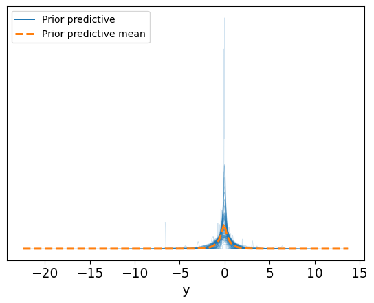
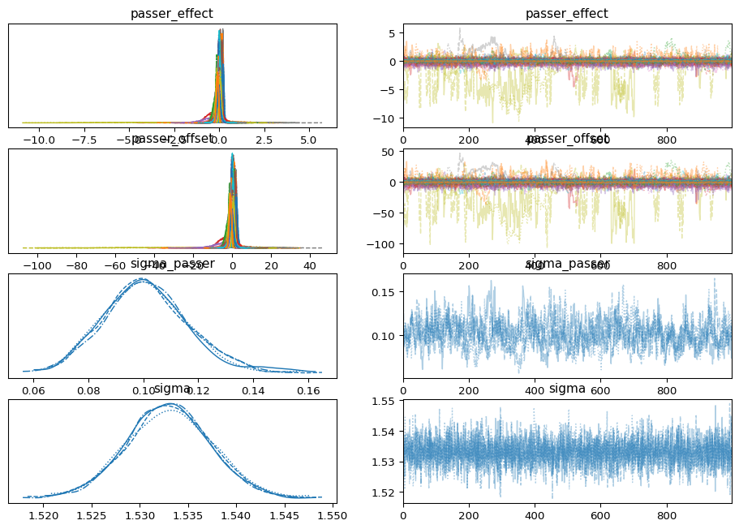
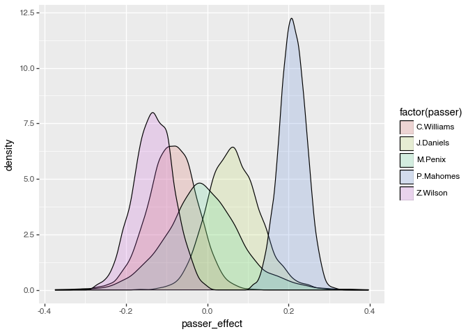
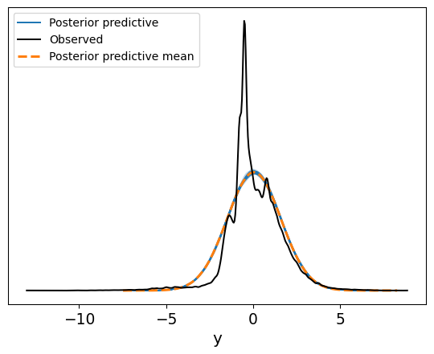
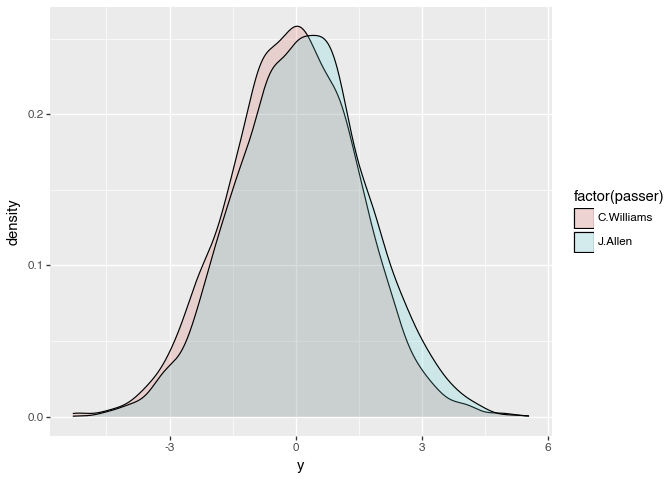

# Load public data

``` python
import numpy as np
import pandas as pd
import pymc as pm
import xarray as xr
import arviz as az
from arviz.stats.stats import hdi
from scipy import stats as stats
from matplotlib import pyplot as plt
import duckdb
import polars as pl
from plotnine import ggplot, aes, geom_density

rng = 527
```

``` python
def get_data(year):
    qbs = (
        pl.read_parquet(
            f"https://github.com/nflverse/nflverse-data/releases/download/pbp/play_by_play_{year}.parquet"
        )
        .filter(
            (pl.col("wp").is_between(0.1, 0.9))
            & (pl.col("penalty") == 0)
            & (pl.col("qb_dropback") == 1)
            & (pl.col("season_type") == "REG")
        )
        .with_columns(qb_dropbacks=pl.col("qb_dropback").sum().over(["passer_id"]))
        #.filter(pl.col("qb_dropbacks") > 1)
        #.select(["passer_id", "passer", "posteam", "complete_pass", "qb_epa", "qb_dropbacks"])
    )

    return qbs

qbs = pl.concat([get_data(year) for year in range(2021, 2025)])

qb_ids = qbs["passer", "passer_id"].unique()

qbs.head()
```

<div><style>
.dataframe > thead > tr,
.dataframe > tbody > tr {
  text-align: right;
  white-space: pre-wrap;
}
</style>
<small>shape: (5, 373)</small>

| play_id | game_id           | old_game_id  | home_team | away_team | season_type | week | posteam | posteam_type | defteam | side_of_field | yardline_100 | game_date    | quarter_seconds_remaining | half_seconds_remaining | game_seconds_remaining | game_half | quarter_end | drive | sp  | qtr | down | goal_to_go | time    | yrdln    | ydstogo | ydsnet | desc                             | play_type | yards_gained | shotgun | no_huddle | qb_dropback | qb_kneel | qb_spike | qb_scramble | pass_length | …   | away_coach        | stadium_id | game_stadium     | aborted_play | success | passer        | passer_jersey_number | rusher | rusher_jersey_number | receiver    | receiver_jersey_number | pass | rush | first_down | special | play | passer_id    | rusher_id | receiver_id  | name          | jersey_number | id           | fantasy_player_name | fantasy_player_id | fantasy     | fantasy_id   | out_of_bounds | home_opening_kickoff | qb_epa    | xyac_epa | xyac_mean_yardage | xyac_median_yardage | xyac_success | xyac_fd  | xpass    | pass_oe   | qb_dropbacks |
|---------|-------------------|--------------|-----------|-----------|-------------|------|---------|--------------|---------|---------------|--------------|--------------|---------------------------|------------------------|------------------------|-----------|-------------|-------|-----|-----|------|------------|---------|----------|---------|--------|----------------------------------|-----------|--------------|---------|-----------|-------------|----------|----------|-------------|-------------|-----|-------------------|------------|------------------|--------------|---------|---------------|----------------------|--------|----------------------|-------------|------------------------|------|------|------------|---------|------|--------------|-----------|--------------|---------------|---------------|--------------|---------------------|-------------------|-------------|--------------|---------------|----------------------|-----------|----------|-------------------|---------------------|--------------|----------|----------|-----------|--------------|
| f64     | str               | str          | str       | str       | str         | i32  | str     | str          | str     | str           | f64          | str          | f64                       | f64                    | f64                    | str       | f64         | f64   | f64 | f64 | f64  | i32        | str     | str      | f64     | f64    | str                              | str       | f64          | f64     | f64       | f64         | f64      | f64      | f64         | str         | …   | str               | str        | str              | f64          | f64     | str           | i32                  | str    | i32                  | str         | i32                    | f64  | f64  | f64        | f64     | f64  | str          | str       | str          | str           | i32           | str          | str                 | str               | str         | str          | f64           | f64                  | f64       | f64      | f64               | i32                 | f64          | f64      | f64      | f64       | f64          |
| 76.0    | "2021_01_ARI_TEN" | "2021091207" | "TEN"     | "ARI"     | "REG"       | 1    | "TEN"   | "home"       | "ARI"   | "TEN"         | 78.0         | "2021-09-12" | 863.0                     | 1763.0                 | 3563.0                 | "Half1"   | 0.0         | 1.0   | 0.0 | 1.0 | 2.0  | 0          | "14:23" | "TEN 22" | 13.0    | 0.0    | "(14:23) (Shotgun) 17-R.Tannehi… | "pass"    | 3.0          | 1.0     | 0.0       | 1.0         | 0.0      | 0.0      | 0.0         | "short"     | …   | "Kliff Kingsbury" | "NAS00"    | "Nissan Stadium" | 0.0          | 1.0     | "R.Tannehill" | 17                   | null   | null                 | "D.Henry"   | 22                     | 1.0  | 0.0  | 0.0        | 0.0     | 1.0  | "00-0029701" | null      | "00-0032764" | "R.Tannehill" | 17            | "00-0029701" | "D.Henry"           | "00-0032764"      | "D.Henry"   | "00-0032764" | 0.0           | 1.0                  | 0.032412  | 1.165133 | 5.803177          | 4                   | 0.896654     | 0.125098 | 0.697346 | 30.265415 | 453.0        |
| 100.0   | "2021_01_ARI_TEN" | "2021091207" | "TEN"     | "ARI"     | "REG"       | 1    | "TEN"   | "home"       | "ARI"   | "TEN"         | 75.0         | "2021-09-12" | 822.0                     | 1722.0                 | 3522.0                 | "Half1"   | 0.0         | 1.0   | 0.0 | 1.0 | 3.0  | 0          | "13:42" | "TEN 25" | 10.0    | 0.0    | "(13:42) (Shotgun) 17-R.Tannehi… | "pass"    | 0.0          | 1.0     | 0.0       | 1.0         | 0.0      | 0.0      | 0.0         | "short"     | …   | "Kliff Kingsbury" | "NAS00"    | "Nissan Stadium" | 0.0          | 0.0     | "R.Tannehill" | 17                   | null   | null                 | "C.Rogers"  | 80                     | 1.0  | 0.0  | 0.0        | 0.0     | 1.0  | "00-0029701" | null      | "00-0032355" | "R.Tannehill" | 17            | "00-0029701" | "C.Rogers"          | "00-0032355"      | "C.Rogers"  | "00-0032355" | 0.0           | 1.0                  | -1.532898 | 0.256036 | 4.147637          | 2                   | 0.965009     | 0.965009 | 0.978253 | 2.174652  | 453.0        |
| 152.0   | "2021_01_ARI_TEN" | "2021091207" | "TEN"     | "ARI"     | "REG"       | 1    | "ARI"   | "away"       | "TEN"   | "ARI"         | 61.0         | "2021-09-12" | 807.0                     | 1707.0                 | 3507.0                 | "Half1"   | 0.0         | 2.0   | 0.0 | 1.0 | 1.0  | 0          | "13:27" | "ARI 39" | 10.0    | 45.0   | "(13:27) (Shotgun) 1-K.Murray p… | "pass"    | 38.0         | 1.0     | 0.0       | 1.0         | 0.0      | 0.0      | 0.0         | "deep"      | …   | "Kliff Kingsbury" | "NAS00"    | "Nissan Stadium" | 0.0          | 1.0     | "K.Murray"    | 1                    | null   | null                 | "D.Hopkins" | 10                     | 1.0  | 0.0  | 1.0        | 0.0     | 1.0  | "00-0035228" | null      | "00-0030564" | "K.Murray"    | 1             | "00-0035228" | "D.Hopkins"         | "00-0030564"      | "D.Hopkins" | "00-0030564" | 1.0           | 1.0                  | 2.69289   | 0.567838 | 7.420427          | 4                   | 1.0          | 1.0      | 0.458989 | 54.10113  | 417.0        |
| 218.0   | "2021_01_ARI_TEN" | "2021091207" | "TEN"     | "ARI"     | "REG"       | 1    | "ARI"   | "away"       | "TEN"   | "TEN"         | 31.0         | "2021-09-12" | 746.0                     | 1646.0                 | 3446.0                 | "Half1"   | 0.0         | 2.0   | 0.0 | 1.0 | 1.0  | 0          | "12:26" | "TEN 31" | 18.0    | 45.0   | "(12:26) (Shotgun) 1-K.Murray p… | "pass"    | 1.0          | 1.0     | 0.0       | 1.0         | 0.0      | 0.0      | 0.0         | "short"     | …   | "Kliff Kingsbury" | "NAS00"    | "Nissan Stadium" | 0.0          | 0.0     | "K.Murray"    | 1                    | null   | null                 | "C.Edmonds" | 2                      | 1.0  | 0.0  | 0.0        | 0.0     | 1.0  | "00-0035228" | null      | "00-0034681" | "K.Murray"    | 1             | "00-0035228" | "C.Edmonds"         | "00-0034681"      | "C.Edmonds" | "00-0034681" | 1.0           | 1.0                  | -0.51109  | 1.036891 | 10.339405         | 9                   | 0.478471     | 0.079696 | 0.684949 | 31.505138 | 417.0        |
| 253.0   | "2021_01_ARI_TEN" | "2021091207" | "TEN"     | "ARI"     | "REG"       | 1    | "ARI"   | "away"       | "TEN"   | "TEN"         | 30.0         | "2021-09-12" | 714.0                     | 1614.0                 | 3414.0                 | "Half1"   | 0.0         | 2.0   | 0.0 | 1.0 | 2.0  | 0          | "11:54" | "TEN 30" | 17.0    | 45.0   | "(11:54) (Shotgun) 1-K.Murray p… | "pass"    | 21.0         | 1.0     | 0.0       | 1.0         | 0.0      | 0.0      | 0.0         | "deep"      | …   | "Kliff Kingsbury" | "NAS00"    | "Nissan Stadium" | 0.0          | 1.0     | "K.Murray"    | 1                    | null   | null                 | "A.Green"   | 18                     | 1.0  | 0.0  | 1.0        | 0.0     | 1.0  | "00-0035228" | null      | "00-0027942" | "K.Murray"    | 1             | "00-0035228" | "A.Green"           | "00-0027942"      | "A.Green"   | "00-0027942" | 1.0           | 1.0                  | 2.182015  | 0.517965 | 3.045047          | 1                   | 1.0          | 0.998799 | 0.775463 | 22.453719 | 417.0        |

</div>

### Model componets

``` python
ggplot(qbs, aes("qb_epa")) + geom_density()
print(f"Mean QB EPA/play: {qbs["qb_epa"].mean():.2f}")
print(f"Mode QB EPA/play: {qbs["qb_epa"].round(1).mode()[0]:.2f}")
print(f"Lower 2.5% QB EPA/play: {qbs["qb_epa"].quantile(0.025):.2f}")
print(f"Upper 97.5% QB EPA/play: {qbs["qb_epa"].quantile(0.975):.2f}")
```

    Mean QB EPA/play: 0.05
    Mode QB EPA/play: -0.50
    Lower 2.5% QB EPA/play: -2.86
    Upper 97.5% QB EPA/play: 3.16

``` python
# categorical to int indexes for pymc
PASSER_IDX, PASSER_ID = pd.factorize(qbs["passer_id"].to_pandas(), sort=True)
N_PASSERS = qbs["passer_id"].n_unique()
```

### Configure Model

``` python
coords = {"passer_id": PASSER_ID, "obs_id": np.arange(len(PASSER_IDX))}

with pm.Model(coords=coords) as model:

    # data
    passer_idx_data = pm.Data("passer_idx", PASSER_IDX, dims='obs_id')
    y_data = pm.Data("y_data", qbs["qb_epa"], dims='obs_id')

    # parameters
    sigma = pm.HalfNormal("sigma", sigma=0.5)
    sigma_passer = pm.HalfNormal("sigma_passer", sigma=0.5)
    passer_offset = pm.Normal(
        "passer_offset",
        mu=-0.2,
        sigma=1,
        dims="passer_id",
    )

    # generated quantities
    passer_effect = pm.Deterministic(
        "passer_effect", passer_offset * sigma_passer, dims="passer_id"
    )
    mu = passer_effect[passer_idx_data]

    # Likelihood
    y = pm.Normal(
        "y",
        mu=mu,
        sigma=sigma,
        observed=y_data,
        shape=passer_idx_data.shape,
        dims="obs_id",
    )
```

### Prior predictive checks

``` python
with model:
    idata = pm.sample_prior_predictive()
```

    Sampling: [passer_offset, sigma, sigma_passer, y]

``` python
def plot_priors(idata: az.InferenceData, y="y"):
    assert "prior_predictive" in idata, "`prior_predictive` unavailable"
    az.plot_ppc(idata, group="prior", num_pp_samples=100)

    y_prior = idata.prior_predictive[y]

    prior_median = y_prior.median().values
    prior_hdi = hdi(y_prior, hdi_prob=0.95)
    hdi_lower = prior_hdi[y].sel(hdi="lower").min().item()
    hdi_upper = prior_hdi[y].sel(hdi="higher").max().item()

    print(
        f"""
    Prior median:      {prior_median:.2f}
    Prior lower 2.5%:  {hdi_lower:.2f}
    Prior upper 97.5%:  {hdi_upper:.2f}
    """
    )


plot_priors(idata)
```


        Prior median:      -0.06
        Prior lower 2.5%:  -2.23
        Prior upper 97.5%:  2.03
        



### Fit model

``` python
with model:
    idata = pm.sample(random_seed=rng, nuts={"target_accept": 0.99})
```

    Initializing NUTS using jitter+adapt_diag...
    Multiprocess sampling (4 chains in 4 jobs)
    NUTS: [sigma, sigma_passer, passer_offset]
    Sampling 4 chains for 1_000 tune and 1_000 draw iterations (4_000 + 4_000 draws total) took 71 seconds.

    Output()

<pre style="white-space:pre;overflow-x:auto;line-height:normal;font-family:Menlo,'DejaVu Sans Mono',consolas,'Courier New',monospace"></pre>

``` python
az.summary(idata)

az.plot_trace(
    idata,
    compact=True,
    var_names=["passer_effect", "passer_offset", "sigma_passer", "sigma"],
)
```

    array([[<Axes: title={'center': 'passer_effect'}>,
            <Axes: title={'center': 'passer_effect'}>],
           [<Axes: title={'center': 'passer_offset'}>,
            <Axes: title={'center': 'passer_offset'}>],
           [<Axes: title={'center': 'sigma_passer'}>,
            <Axes: title={'center': 'sigma_passer'}>],
           [<Axes: title={'center': 'sigma'}>,
            <Axes: title={'center': 'sigma'}>]], dtype=object)



``` python
df_posterior = idata.posterior.to_dataframe().reset_index().merge(qb_ids.to_pandas(), on=['passer_id'], how='left')
```

``` python
_qbs = ["B.Nix", "J.Daniels", "C.Williams", "M.Penix"]
#_qbs = ['P.Mahomes', 'C.Williams', 'J.Daniels', 'M.Penix', 'Z.Wilson']


df_passer_effect = df_posterior[df_posterior['passer'].isin(_qbs)]

(
    ggplot(df_passer_effect, aes("passer_effect", fill="factor(passer)"))
    + geom_density(alpha=0.2)
)
```



``` python
pl.from_pandas(df_passer_effect).group_by(["passer"]).agg(
    median=pl.col("passer_effect").median(),
    mean=pl.col("passer_effect").mean(),
    sd=pl.col("passer_effect").std(),
    lower=pl.col("passer_effect").quantile(0.075),
    upper=pl.col("passer_effect").quantile(0.975),
).sort("mean", descending=True)
```

<div><style>
.dataframe > thead > tr,
.dataframe > tbody > tr {
  text-align: right;
  white-space: pre-wrap;
}
</style>
<small>shape: (4, 6)</small>

| passer       | median    | mean      | sd       | lower     | upper    |
|--------------|-----------|-----------|----------|-----------|----------|
| str          | f64       | f64       | f64      | f64       | f64      |
| "J.Daniels"  | 0.070669  | 0.070105  | 0.06568  | -0.0222   | 0.198537 |
| "B.Nix"      | 0.026895  | 0.027941  | 0.061208 | -0.061506 | 0.147177 |
| "M.Penix"    | -0.008801 | -0.009233 | 0.096385 | -0.150668 | 0.179406 |
| "C.Williams" | -0.093416 | -0.093161 | 0.061802 | -0.182682 | 0.024733 |

</div>

``` python
with model:
    pm.sample_posterior_predictive(idata, extend_inferencedata=True)
```

    Sampling: [y]

    Output()

<pre style="white-space:pre;overflow-x:auto;line-height:normal;font-family:Menlo,'DejaVu Sans Mono',consolas,'Courier New',monospace"></pre>

``` python
az.plot_ppc(idata, group='posterior', num_pp_samples=100)
```

    <Axes: xlabel='y'>



``` python
_qbs = (
    qbs.with_columns(passer_idx=PASSER_IDX)
    .filter(pl.col("passer").is_in(["J.Allen", "C.Williams"]))[
        ["passer", "passer_id", "passer_idx"]
    ]
    .unique()
    .to_pandas()
)

_passers = ["00-0039910", "00-0039918"]

with model:
    pm.set_data(
        {"passer_idx": _qbs["passer_idx"]},
        coords={"passer_id": _qbs["passer_id"], "obs_id": np.arange(_qbs.shape[0])},
    )

    pp = pm.sample_posterior_predictive(
        idata,
        predictions=True,
        var_names=["y"],
        extend_inferencedata=False,
    )

df_post_preds = pp.predictions["y"].assign_coords(
    passer=("obs_id", _qbs['passer'])
).to_dataframe().reset_index()
```

    Sampling: [y]

    Output()

<pre style="white-space:pre;overflow-x:auto;line-height:normal;font-family:Menlo,'DejaVu Sans Mono',consolas,'Courier New',monospace"></pre>

``` python
(ggplot(df_post_preds, aes('y', fill='factor(passer)')) + geom_density(alpha = 0.2))
```


